# Kingdom Snap Memory Game

Welcome to the Kingdom Memory Game! Immerse yourself in a medieval realm filled with kings, shields, swords, coins, chests, scripts, and helmets. The objective is to match all 12 pairs of cards as fast as you can!

This is Milestone Project 2 for a Level 5 Diploma in Web Application Development. This website features four html pages and is built using technologies that I have learnt since staring the course including HTML, CSS and Javascript.

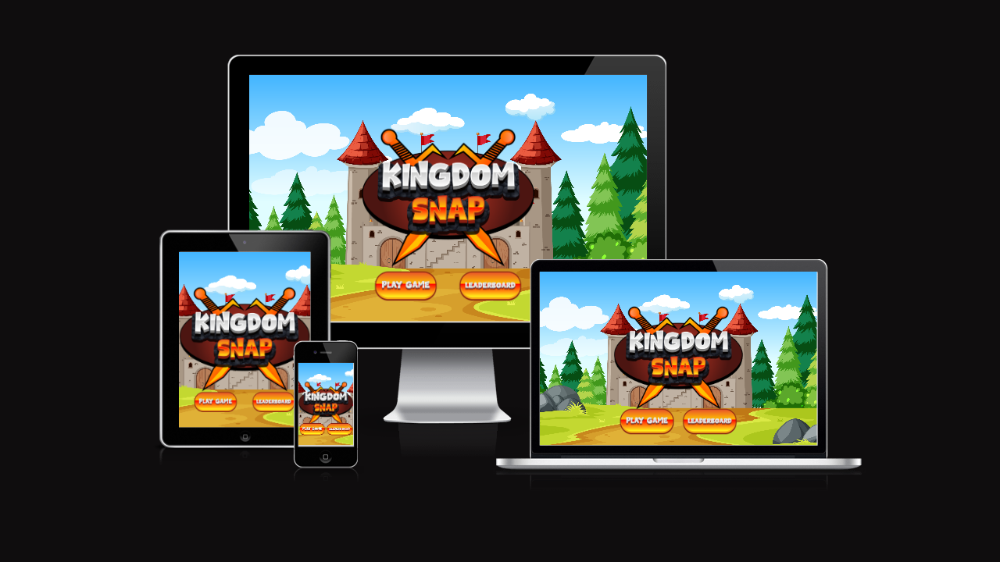

## Live Link

[Live Link to project (Kingdom Snap)](https://codelegg.github.io/Kingdom-Snap-Milestone-Project-two-final-/)

## Table of Contents

- [User Experience](#user-experience-(UX))
  * [User Stories](#user-stories)

- [Design](#design)
  * [Colour Scheme](#colour-scheme)
  * [Typography](#typography)  
  * [Wireframes](#wireframes-sketches)
  * [Layout & Features](#layout--features)
  * [Audio](#audio)
  * [Future Implementations](#future-implementations)
  * [Accessibility](#accessibility)

- [Technologies Used](#technologies-used)
  * [Languages Used](#languages-used)
  * [Frameworks, Libraries & Programs Used](#frameworks-libraries--programs-used)

- [Testing](#testing)
- [Deployment](#deployment)
- [Credits](#credits)
  * [Content](#content)
  * [Media](#media)
  * [Acknowledgments](#acknowledgments)
  

### User Experience (UX)

### User Stories

1. As someone eager to delve into the rich tapestry of medieval kingdoms, I am in search of an engaging memory game that introduces me to the intricacies of royal elements such as shields, swords, coins, chests, scripts, and helmets. My aim is to build knowledge and test my memory skills through a comprehensive Kingdom memory game designed for all levels of intelligence.

2. With a year-long exposure to the nuances of medieval lore, I am seeking a challenging memory game that goes beyond mere entertainment. Focused on shields, swords, coins, chests, scripts, and helmets, I am eager to put my knowledge to the test. The game's ability to provide a stimulating challenge while keeping time adds an extra layer of excitement to my experience.

3. With a keen interest in royal emblems like shields, swords, coins, chests, scripts, and helmets, I am actively seeking a memory game that caters to my depth of general knowledge. The ideal game, in my perspective, provides a customizable experience, enabling me to engage in a singular yet challenging level. I envision a platform that not only captivates me with its entertainment value but also elevates my understanding of medieval symbols through its interactive and enriching gameplay.

4. With a fervent interest in medieval history, I am on a quest for a captivating memory game that transcends ordinary entertainment. Centered around regal elements such as shields, swords, coins, chests, scripts, and helmets, the prospect of challenging my memory skills excites me. This game's unique blend of a demanding experience and a time constraint promises an exhilarating journey, perfectly aligning with my profound appreciation for medieval lore.

### Design

### Colour Scheme

- In crafting the visual palette for this project, I meticulously curated a spectrum of colors that resonates with the majestic ambiance of castles and regality. The infusion of warm reds, earthy browns, and vibrant yellows imparts a sense of grandeur, reminiscent of royal tapestries adorning castle walls. Meanwhile, the incorporation of rich greens and blues evokes the lush landscapes surrounding medieval realms, infusing the design with a touch of natural splendor.

- The choice of a diverse range of greys serves to complement and ground the vibrant hues, adding a sophisticated touch to the overall aesthetic. This thoughtfully curated color scheme not only enhances the visual appeal but also harmonizes seamlessly with the royal king theme, creating a captivating and immersive experience for users as they navigate the medieval-inspired memory game.

### Typography

- Font: Dragon Fruit Days
- Font: Roboto

- The selection of fonts in this project is a deliberate curation based on their aesthetic appeal and harmonious integration with the overall design. Each chosen font contributes to the visual identity of the project, enhancing the user experience by encapsulating the essence of medieval regality.

- The fonts employed, with their distinct styles and personalities, have been carefully chosen to resonate with the project's theme. This intentional selection not only reflects a keen eye for design but also ensures a cohesive and captivating visual narrative. As users engage with the content, the chosen fonts play a pivotal role in conveying a sense of elegance and authenticity, further elevating the overall design aesthetics.

### Wireframes Sketches

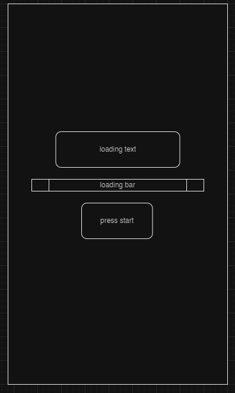
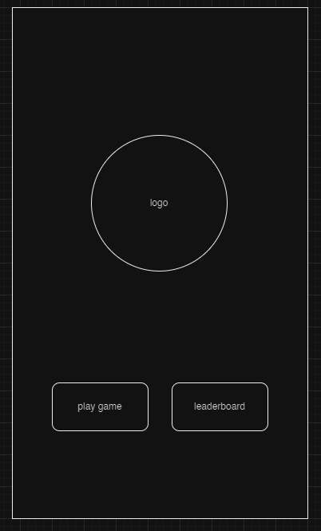
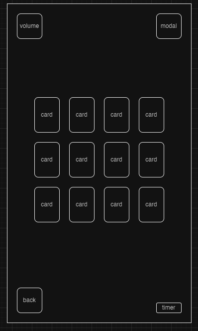
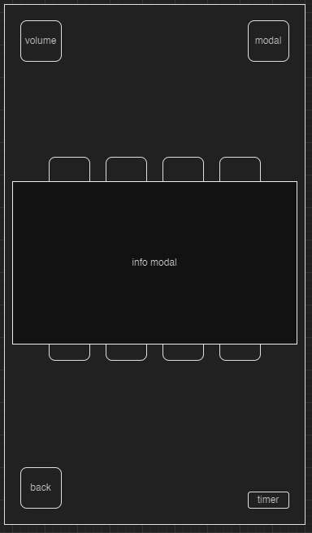
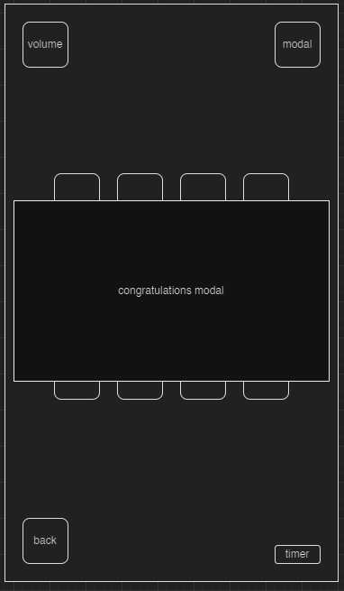
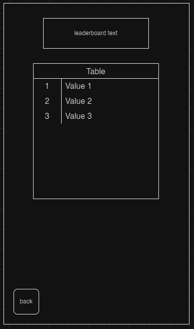

### Layout & Features

<!-- **The website is designed to be interactive with various stages:** -->

 
## Introduction: A Majestic Unveiling
  
- Embark on a journey through time and royalty as the loading screen gracefully unfolds over 8 seconds. Anticipation builds as the intricacies of the medieval realm come to life. A masterpiece in the making, this loading screen sets the stage for an immersive experience. When the curtain finally rises, a radiant "Start" button emerges, inviting you to commence your royal adventure. Only then, with the button's elegant fade-in, does the true journey into the kingdom's memory game commence.

## Start Screen: A Royal Gateway

- Step into the grandeur of the Kingdom Snap memory game with a visually striking start screen. A regal emblem, adorned with the Kingdom Snap logo, takes center stage, embodying the essence of medieval splendor. Before you, two distinguished buttons await—Play Game and Leaderboards—each promising a unique path into the heart of the kingdom.

- The Play Game button beckons you to embark on a journey through the medieval realm, testing your memory and wit. As you click, the gates open to reveal the captivating challenges that lie within the kingdom's memory game.

- On the other side, the Leaderboards button is a portal to honor and recognition. Clicking it unfolds a table displaying the bravest contenders and their triumphs. Here, the kingdom's elite showcase their mastery, leaving a mark in the hallowed halls of memory game glory.

- This splendid introduction sets the tone for an extraordinary memory game, where every click is a step towards unraveling the mysteries of the medieval realm. Choose your adventure wisely, whether to be a valiant player or an esteemed observer of the kingdom's finest!

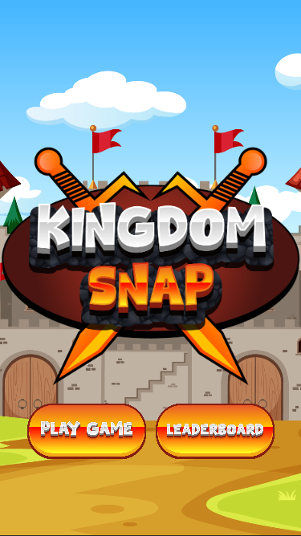

## Game Board: Unveiling the Royal Pairs

- Embark on a noble quest within the Kingdom Snap memory game, where the game board unveils a regal tapestry adorned with twelve majestic cards. As you step into this arena of memory and strategy, the objective becomes clear: match the royal pairs hidden behind the cards.

- Behold the game board, a canvas of medieval symbols such as shields, swords, coins, chests, scripts, and helmets, overseen by the watchful eye of the king himself. Each card is a portal to the kingdom's secrets, waiting to be unlocked by the prowess of your memory.

- With every turn, the cards reveal glimpses of the royal court, creating a tapestry of challenges and excitement. The royal pairs, scattered amidst the cards, demand your attention and keen observation. Will you uncover the regal connections and stand as a memory game champion, earning the king's favor?

- Embrace the thrill as you flip each card, revealing the symbols that hold the key to your victory. The Kingdom Snap memory game board is not just a playing field; it's a gateway to medieval wonders and a test of your memory prowess, all under the benevolent gaze of the king. May your memory be sharp, and your journey through the royal pairs be triumphant!

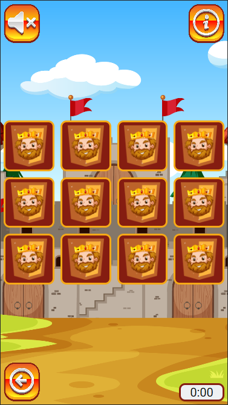

## Feedback Messages: Matching or Not Matching the Royal Pairs

- In the unpredictable realm of *Kingdom Snap*, the feedback messages are there, delivering insights and encouragement and on your noble quest.

**Match Found! Keep Going!**
  - If users match a pair of cards correctly, they receive a 'Match Found! Keep Going!' message.

**The King is getting worried!**
    
- If users match a 3 pair of cards correctly in a row, they receive a 'The King is getting worried!' message.

**No Match. Try Again.**
  - A setback, brave adventurer. The messenger is resilient, and so are you. Retry with determination, sparing the messenger, and may victory be yours in the next attempt!

**The Kingdom Stands Strong!**
  - Fear not, champion! Challenges may arise, but the kingdom endures. Press on, reveal more pairs, and earn the admiration of the royal court.

  
## Game Buttons: Navigate the Kingdom's Buttons

Within the royal realm of the Kingdom Snap memory game, a set of distinguished buttons awaits your command, each playing a crucial role in your noble quest.

**Back Button:** 

- A regal emblem that serves as your loyal steed, ready to transport you back to the grandeur of the start screen. Should you desire to reassess your strategy or embark on a fresh journey, the Back Button stands at your service.

**Sound Buttons (Play and Mute):** 

- These melodic maestros control the symphony of the kingdom's soundtrack. The "Play" button unleashes a majestic melody, immersing you in the medieval ambiance, while the "Mute" button provides a serene silence, allowing you to strategize in peace.

**Info Modal:** 

- A key to unraveling the mysteries of the game, the Info Modal opens a gateway to detailed information about the Kingdom Snap memory game. Seek guidance, understand the rules, and fortify your approach before venturing deeper into the royal challenges.

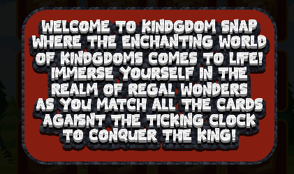

**Timer Display:** 

- The ticking heartbeat of the kingdom, the Timer Display emerges when the first card is flipped and counts down the moments until the last card is chosen resulting in all the matches been matched. Witness the passage of time as you navigate the memory game, adding an extra layer of exhilaration to your quest.

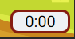
 
## Completion: The Royal Triumph

- Behold, noble contender, as your journey through the medieval realm culminates in a momentous Completion! The air is charged with the exhilaration of victory as you stand on the precipice of the royal triumph. But fear not, for this is not merely an end—it is a proclamation of your prowess in the Kingdom Snap memory game.

- As the final pair of regal emblems align in harmonious unity, a majestic Congratulation Modal graces your screen. Adorned with the grandeur befitting a triumphant hero, this modal extends its royal accolades, celebrating your memory mastery in the face of medieval challenges.

- Within the hallowed space of the Congratulation Modal, a regal proclamation awaits, revealing the time it took for you to conquer the kingdom's memory trials. A subtle invitation prompts you to inscribe your name in the annals of the royal leaderboard, forever immortalizing your victory.

- In a final act of royal recognition, the Congratulation Modal offers a noble podium—a sacred space where your name and time will be eternally etched. Seize this moment, and with a click, submit your name to the leaderboard, securing your place among the kingdom's memory elite.

- Amidst the regal backdrop, the Congratulation Modal stands as a testament to your memory prowess—a dazzling finale to your journey through the Kingdom Snap memory game. Bask in the glory of your triumph, noble player, for you have proven yourself worthy of the medieval crown.
  
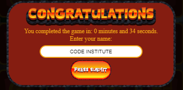 
  

## Leaderboard: Ascend to Royal Glory

- Step into the hallowed halls of the Kingdom Snap's royal leaderboard an esteemed space where the names of memory champions echo through time. This is not merely a list; it is a testament to the prowess of those who have conquered the memory challenges of the medieval realm.

- As you submit your name and time from the illustrious Congratulation Modal, your legacy is etched into the annals of the royal leaderboard. Witness the digital parchment unfurl, revealing the names of those who have ascended to royal glory, each entry a beacon of triumph in the face of memory trials.

- Embrace the honor bestowed upon you as your name joins the ranks of the memory elite. The leaderboard, like a grand tapestry, captures the essence of your victory—a tapestry woven with the threads of noble endeavors and triumphant memory conquests.

- In this digital kingdom, the leaderboard stands as a majestic testament to the memory masters who have dared to venture into the realm of regal challenges. Ascend to royal glory, noble contender, and may your name shine brightly among the stars of the Kingdom Snap leaderboard.

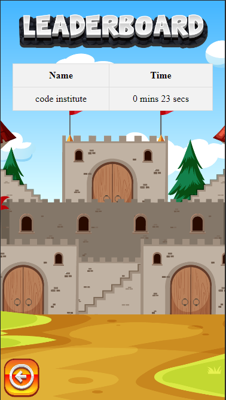

## Symbology: Unveiling the Royal Tapestry

- Embark on a journey through the rich tapestry of Kingdom Snap's symbology a tapestry woven with the threads of medieval elegance and regal significance. Each element, meticulously chosen, contributes to the immersive experience, transforming the game into more than a mere challenge—it becomes a digital odyssey through the kingdom's symbolism.

- Shields: Symbolizing strength and protection, shields stand as guardians in the digital kingdom—an emblem of resilience in the face of memory challenges.

- Swords: The blades of medieval prowess, swords signify the courage needed to delve into the depths of memory and conquer each card pair.

- Coins: Beyond mere currency, coins echo the value of knowledge, reminding players that every memory holds a priceless treasure waiting to be unveiled.

- Chests: Locked with mystery, chests embody the anticipation of discovery—a visual representation of the secrets hidden behind each card.

- Scripts: Unraveling the scrolls of ancient wisdom, scripts add an intellectual layer, emphasizing the cognitive journey within the medieval-themed memory game.

- Helmets: As a symbol of protection and valor, helmets encapsulate the essence of the digital knight, guiding players through the challenges with dignity and courage.

- King: The regal figure, draped in the splendor of the digital kingdom, personifies leadership and authority. As the guiding force throughout the game, the king symbolizes strategic prowess, overseeing the realm with wisdom and majesty. Players, akin to loyal subjects, navigate the challenges under the king's watchful eye, creating a sense of grandeur and purpose in every move. The digital kingdom bows to the king's influence, adding an aura of royal sophistication to the Kingdom Snap memory game.

- Together, these symbols form a royal tapestry, interwoven with the spirit of medieval lore. As you traverse the game, each element whispers tales of a bygone era, inviting players to not only match cards but to immerse themselves in the symbolic realm of Kingdom Snap.

### Audio

**Audio: A Harmonious Tapestry**

- In the symphony of Kingdom Snap, the audio selection becomes a crucial thread, weaving together the fabric of the medieval adventure. The chosen soundtrack, "Kingdom of Heaven - Crusaders," resonates as a harmonious tapestry that enriches the player's journey with a melodic blend of grandeur and historical resonance.

- As the ethereal notes of the Crusaders' anthem fill the digital air, players are transported to a realm where the echoes of medieval battles and regal courts come to life. The soundtrack, a digital companion to the memory game, serves as both a narrative backdrop and a sonic guide, immersing players in the essence of a bygone era.

- With every click and flip of a card, the Crusaders' symphony becomes a dynamic companion, synchronizing with the gameplay's ebb and flow. The audio selection transcends the role of mere background music; it becomes a storytelling element, enhancing the thematic richness of each royal encounter and memory challenge.

- The link to the Kingdom of Heaven soundtrack - Crusaders [Click For Youtube Soundtrack](https://www.youtube.com/watch?v=02PxQmHIQ5o)  
opens a gateway to an auditory journey that mirrors the grandiosity of medieval courts. From the majestic rise of orchestral crescendos to the delicate notes that accompany moments of reflection, the soundtrack envelops players in an immersive experience—an auditory tapestry that elevates Kingdom Snap beyond a mere memory game to a multisensory medieval odyssey.

### Future Implementations

- Leaderboard could be stored on a server and not just in local storage.

- Leaderboard positions could be colour coded with Gold, Silver and Bronze for First, Second and Third.

### Accessibility
- The site has scored highly in terms of accessibility, I have included alt text descriptions for all images to provide context and information to visually impaired users.

## Technologies Used

### Languages Used

- HTML5
- CSS
- JavaScript

### Frameworks, Libraries & Programs Used

- [GitHub](https://github.com/)
- [Visual Studio Code](https://code.visualstudio.com/)
- [Google Chrome Dev Tools](https://www.google.com/)
- [Adobe Illustrator](https://www.adobe.com/uk/products/illustrator/campaign/pricing.html?mv=search&mv=search&mv2=paidsearch&sdid=GMCWY69B&ef_id=7f919b153c29137ac9cffe7ab14557ad:G:s&s_kwcid=AL!3085!10!79371087385138!79371161872161)
- [W3schools](https://www.w3schools.com/)
- [Google Fonts](https://fonts.google.com/)
- [Drawio](https://app.diagrams.net/)

## Testing
- Testing process can be found [here](TESTING.md)

## Deployment

**How was this site deployed?**

- The website was initially deployed on GitHub pages.

**Deploying on GitHub Pages**  
- To deploy the website on GitHub Pages, the following steps were followed:

**Create a new repository on GitHub**  
- Add the necessary files to the repository.
- Go to the settings page of the repository, located on the menu bar towards the top of the page, scroll down to the GitHub Pages section which is located at the bottom of the 'Code and automation' sub-section.
- Select the main branch and the root folder, then click save.
- The website will now be live at the URL provided in the GitHub Pages section.

**How to clone the repository**

- Go to the https://github.com/CodeLegg/Kingdom-Snap-Milestone-Project-two-final- repository on GitHub.
- Click the "Code" button to the right of the screen, click HTTPs and copy the link there.
- Open a GitBash terminal and navigate to the directory where you want to locate the clone.
- On the command line, type "git clone" then paste in the copied url and press the Enter key to begin the clone process.  

**How to Fork the repository**  

- Go to the https://github.com/CodeLegg/Kingdom-Snap-Milestone-Project-two-final- repository on GitHub.
- Click on the 'Fork' option towards the top left of the page.  
- Click the dropdown button and click 'create a new fork'.  
- This will bring up a page with details of the repository, fill in boxes as required.
- Click 'create fork'.  

- For further guidance [click here](https://docs.github.com/en/get-started/quickstart/fork-a-repo)  

- Forking this repository will allow changes to be made without affecting the original repository.

## Credits

### Content

- Freecodecamp.org tutorial [Link to the tutorial]()

## Media

#### Images

- [Link to the icons used for the game!](https://www.freepik.com/free-vector/video-game-elements-collection_40127922.htm)

### Acknowledgments

- Code Institute training material
- Freecodecamp.org
- Juliia Mentor
