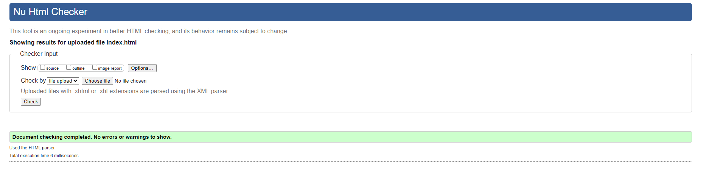
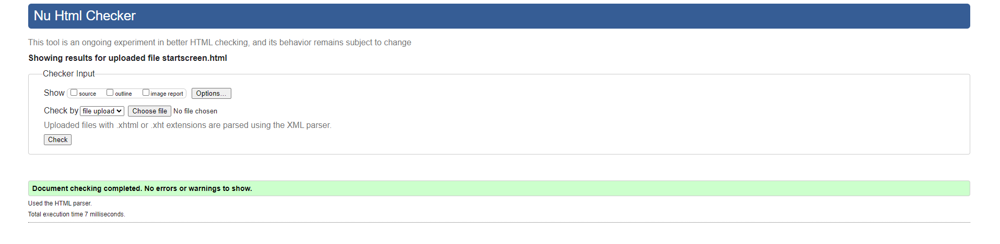
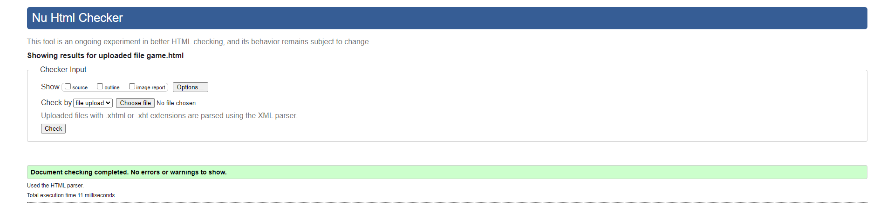
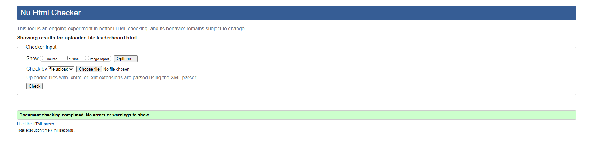
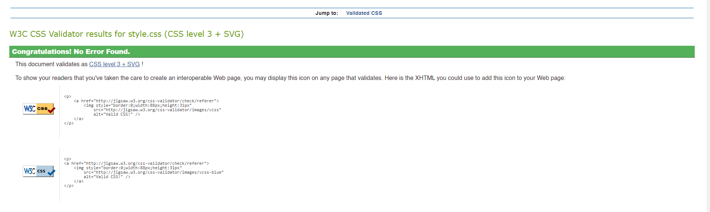
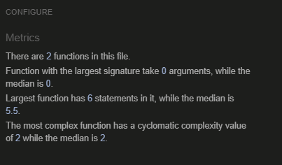
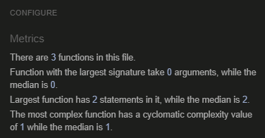
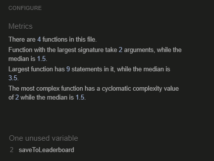
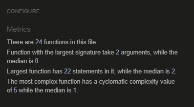
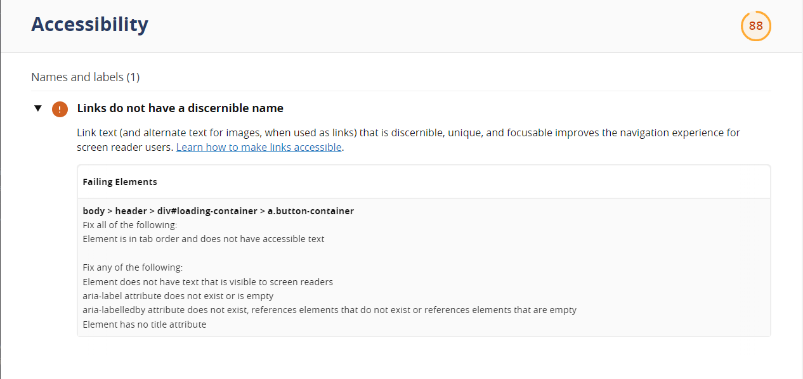

# Testing

## Contents

This site has been tested using the following testing procedures

- [Code Validation](#Code-validation)

- [Lighthouse Testing](#Lighthouse)

- [Browser Compatibility](#Browser-Compatibility)

- [Manual Testing](#Manual-Testing)

- [Bug Reporting](#Bug-Reporting)

## Code Validation

The site was run through both W3C and W3C CSS validators.

The validator showed no warning for the index.html page.

The validator showed no warning for the startscreen.html page.

The validator showed no warning for the game.html page.

The validator showed no warning but showed one unused variable for the leaderboard.html page.

The validator showed no warning for the CSS

***

The validator showed no warning for the gamesound.js script.

***

The validator showed no warning for the script.js script.

***

The validator showed no warning for the leaderboard.js script.

***

The validator showed no warning for the game-script.js script.

***

## Lighthouse

***

## Browser Compatibility

| Browser        |                     Version                      | Bugs |
| -------------- | :----------------------------------------------: | ---: |
| Google Chrome  | Version 112.0.5615.138 (Official Build) (64-bit) | None |
| Microsoft Edge | Version 112.0.1722.58 (Official build) (64-bit)  | None |
| Firefox        |                 112.0.1 (64-bit)                 | None |

| Device                   | Operating system | Bugs  |
| -------------            |:-------------:   | -----:|
| iPhone 12                | iOS 16.3.1       | None  |
| iPhone 14 pro MAX            | iOS 16.0         | None  |
| Iphone 6/7/8 | iOS 16.3.1       | None  |

***

## Manual Testing  

During the manual testing, I tested the sites functionality, usability and responsiveness. 

#### Functionality

**Quiz Logic**
In the Kingdom Snap realm-themed memory game, the synergy of thematic symbols and engaging feedback messages elevates the gaming experience. As players delve into the challenge of matching kingdom items, the timer adds an element of urgency to the quest for pairs. The game logic ensures that when a successful match is made, a rewarding message appears, fostering a sense of achievement and motivating players to press on. On the flip side, if the cards don't align, a helpful message gently steers players in the right direction, encouraging them to refine their recall skills. The special feature of recognizing players for consecutively matching three pairs in a row adds an exciting dynamic, celebrating their exceptional memory prowess. Meanwhile, a witty message surfaces when three consecutive attempts yield no matches, inspiring perseverance in the face of adversity. This carefully balanced combination of thematic elements and feedback messages transforms the Kingdom Snap memory game into a mentally stimulating and delightful journey through the rich realms of memory and strategy.

Index.html
- All buttons worked as expected.  
- Loading bar animation worked as expected.    

startscreen.html
- All buttons worked as expected.  
- Images work as expected

game.html
- Timer worked as expected.
- Feedback messages work as expected.  
- All buttons worked as expected.
- All modals worked as expected.  

Leaderboard.html
 - All buttons worked as expected.  
- The users name is displayed as expected.  
- The users time is displayed as expected.   

**Usability**  

- Some users felt more levels could have been used.

**Responsiveness** 

I used the following break points for responsiveness.

- Portrait Phones and Small Tablets:

- 376px to 429px

- 430px to 525px

- 526px to 626px

- 627px to 767px

***

- Medium Devices (Phones, Tablets, and Small Laptops):

- 768px to 860px
- 861px to 1023px

***

- Large Devices (Tablets, Laptops, and Desktops):

- 1024px to 1279px

***

- Extra Large Devices (Desktops):

- 1280px to 1439px

***

- Ultra Large Devices (Larger Desktops and 4K Screens):

- 1440px to 1599px

***

- Extra Extra Large Devices:

- 1600px to 1919px

***

- Extra Extra Extra Large Devices:

- 1920px to 2239px

***

- Extra Extra Extra Extra Large Devices:

- 2240px to 2560px

***

- Laptops - 1366px:

***

- 1000px to 1440px

***

- Laptops - 1440px:

***

- 1440px to 1440px

***

- Larger Screens (Above Common Resolutions):

- 2561px and above

***

- Landscape Orientation for Mobile and Tablets:

- Max width for tablets and small screens in landscape orientation (max-width: 768px) and (orientation: landscape)

***

- The use of these breakpoints allowed the site to be mobile friendly and could be used on a range of different screen sizes.  

## Bug Reporting

**Bug: Inconsistent Font Sizes on Medium Devices**

- Issue: On devices with screen widths ranging from 768px to 1023px, the font sizes for congratulatory messages and player names were inconsistent.
Resolution: Adjusted the CSS styles for these devices to ensure uniform font sizes and spacing.

**Bug: Overlapping Buttons on Extra Large Devices**

- Issue: Buttons in the start-screen button container were overlapping on devices with screen widths between 1600px and 1919px.
Resolution: Modified the gap property in the CSS styles to provide adequate spacing, preventing button overlap.

**Bug: Timer Display Issue on 1440p Screens**

- Issue: The timer display was not rendering correctly on screens with a resolution of 1440p (2560px width), leading to a distorted appearance.
Resolution: Adjusted the timer styles for screens with a width of 1440px to ensure proper rendering.

**Bug: Ineffective Fade-In Effect**

- Issue: Attempted to implement a fade-in effect for certain elements, but it did not work consistently across all devices, causing visual inconsistencies.
Resolution: After unsuccessful attempts to address the fade-in issue and considering its impact on the user experience, the decision was made to remove the fade-in effect entirely. This ensures a smoother and more reliable user interface.

**Bug: Player Name Input Field Alignment**

- Issue: On devices with screen widths between 430px and 525px, the player name input field was not aligned correctly, causing a visual misalignment.
Resolution: Adjusted the CSS styles for the player name input field to ensure proper alignment on these specific devices.

[Back to README.md](https://github.com/CodeLegg/Kingdom-Snap-Milestone-Project-two-final-)