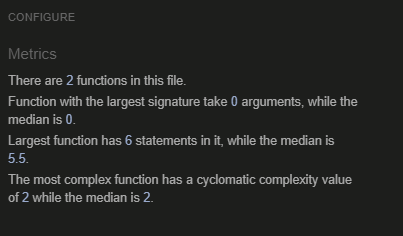
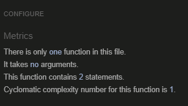
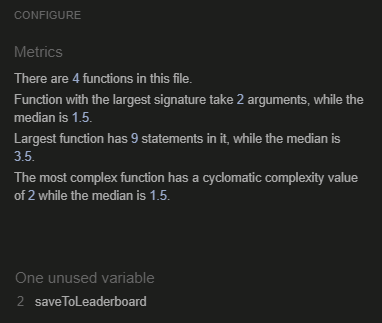
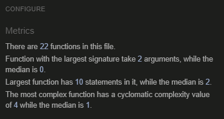

# Testing

## Contents

This site has been tested using the following testing procedures

* [Code Validation](#Code-validation)  

* [Lighthouse Testing](#Lighthouse-Testing)

* [Browser Compatibility](#Browser-Compatibility)

* [Automatic Testing](#Automatic-Testing)

* [Manual Testing](#Manual-Testing)

* [Bug Reporting](#Bug-Reporting)

## Code Validation  

The site was run through both W3C and W3C CSS validators.

The validator showed no warning for the index.html page.

The validator showed no warning for the startscreen.html page.

The validator showed no warning for the game.html page.

The validator showed no warning for the leaderboard.html page.

The validator showed no warning for the leaderboard.html page.

The validator showed no warning for the gamesound.js script.

The validator showed no warning for the script.js script.

The validator showed no warning for the leaderboard.js script.

The validator showed no warning for the game-script.js script.
